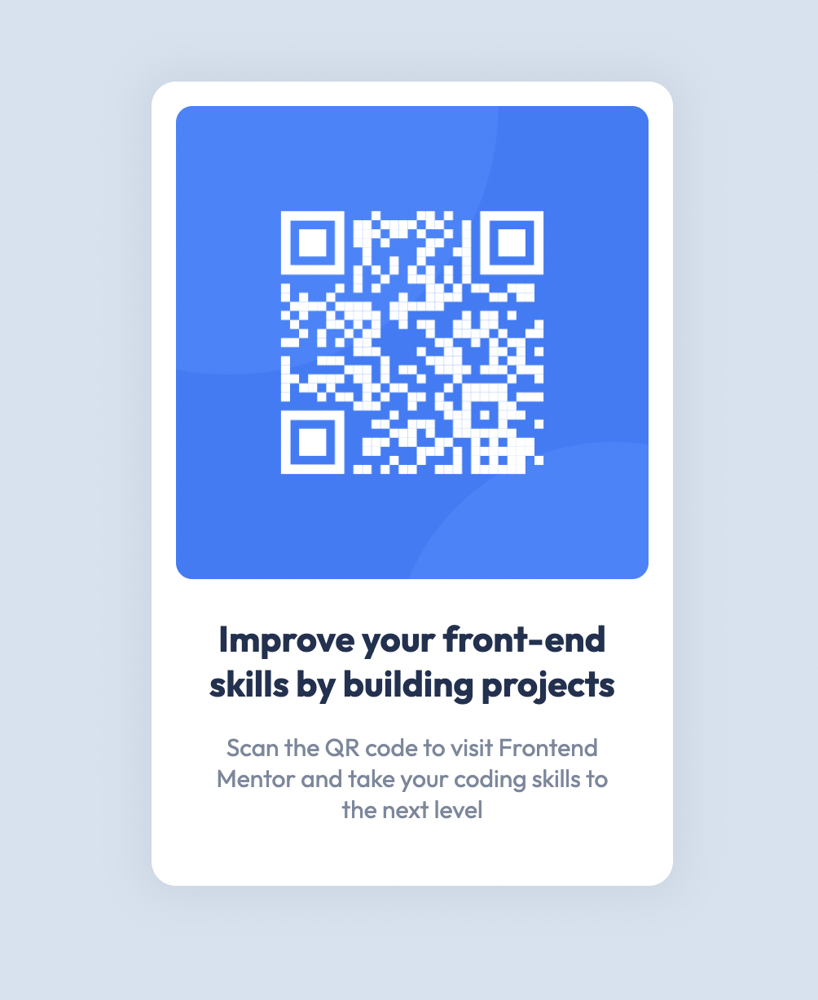

# Frontend Mentor - QR code component solution

This is a solution to the [QR code component challenge on Frontend Mentor](https://www.frontendmentor.io/challenges/qr-code-component-iux_sIO_H). Frontend Mentor challenges help you improve your coding skills by building realistic projects. 

## Table of contents

- [Frontend Mentor - QR code component solution](#frontend-mentor---qr-code-component-solution)
  - [Table of contents](#table-of-contents)
  - [Overview](#overview)
    - [Screenshot](#screenshot)
    - [Links](#links)
  - [My process](#my-process)
    - [Built with](#built-with)
    - [What I learned](#what-i-learned)
    - [Continued development](#continued-development)
  - [Author](#author)
  - [Acknowledgments](#acknowledgments)

## Overview

### Screenshot

### Links

- Solution URL: [Add solution URL here](https://www.frontendmentor.io/solutions/qr-code-component-solution-MIe-MKt3o3)
- Live Site URL: [Add live site URL here](https://lrvaka.github.io/FEM-qr-code-component/)

## My process

First time completing a Front End Mentor exercise, wanted to see
what it was about. The exercise was straightforward, I started with creating
semantic html with BEM style class names. I then proceeded with implementing the base colors and styles for the overall project. Then styled the items block by block from the top - down. I had to do a lot of tinkering and use precise values to have the spacing, padding, etc. between elements to look exact, but I was able to get as close as I could.

### Built with

- Semantic HTML5 markup
- CSS custom properties
- Flexbox

### What I learned

This exercise has given me valuable practice with markdown documents, which I know will play a big role in the future when I have to write documentation. Besides practice in markdown, I haven't learned anything new, but I was able to get some valuable practice in HTML and CSS.

### Continued development

I would like to continue developing my skills in mimicking design files. I believe Front End Mentor is the perfect tool for practicing those skills. It will help me highlight any weaknesses and strengths I have and improve upon them.

## Author

- Website - [Luke Vakasisikakala](https://lrvaka.com/)
- Frontend Mentor - [@lrvaka](https://www.frontendmentor.io/profile/lrvaka)

## Acknowledgments

Mum.
